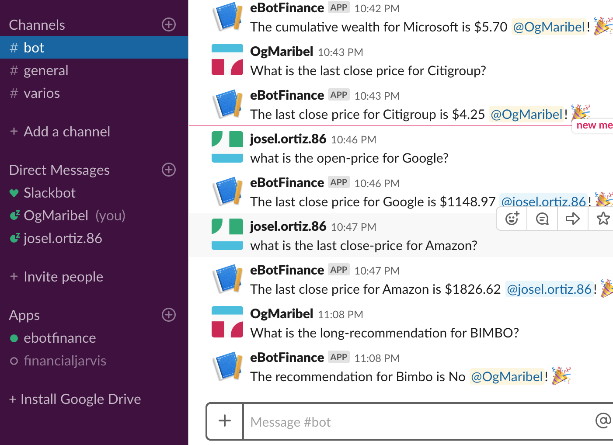
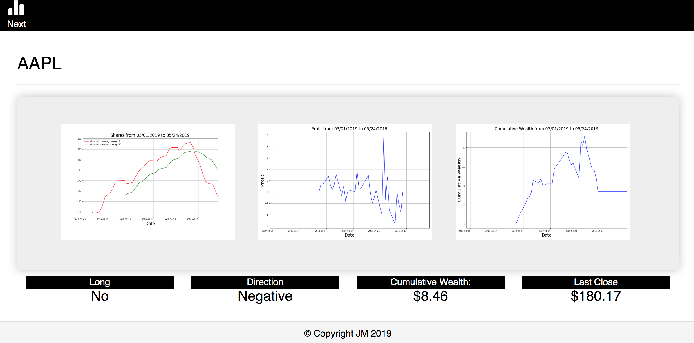

# ETL_Project

For this project a stock market recommendation system was created using the Extract, Transform and Load method. It consists of two tools a Dashboard to check the last updates of an specific company and a chatbot using slack as the interface to ask some questions in order to figure out if the company is a good investment:

## Description
The project uses the ETL method. 

### For thcontains the following documents:
* A jupyter notebook were the 

